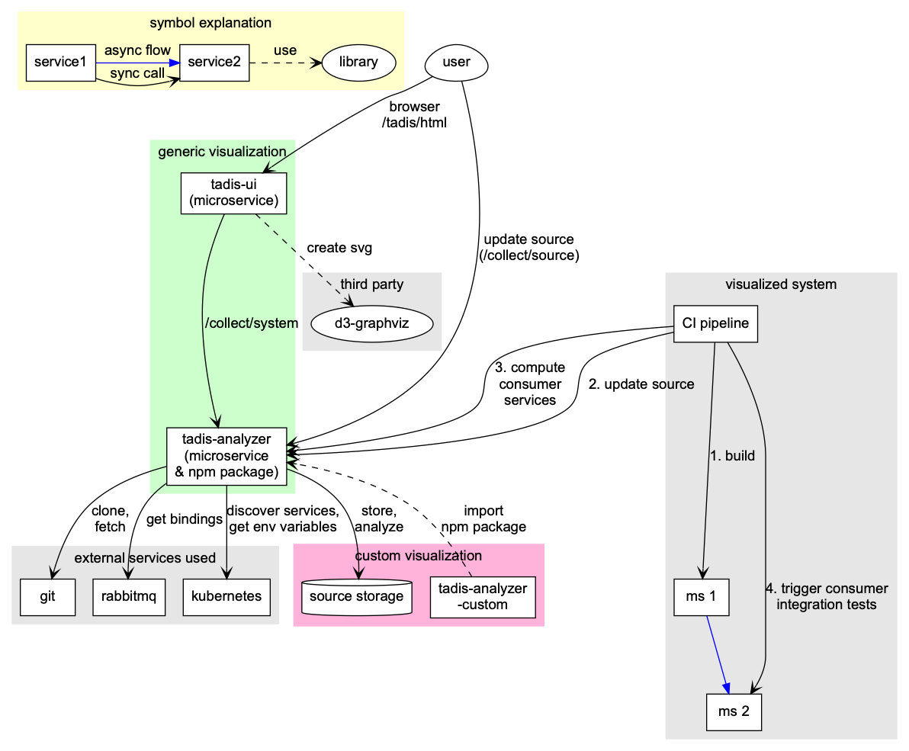

# Microservice Visualization with TADIS - a Tool for Architecture Discovery

This repository contains software for analyzing and visualizing the topology of a microservice system.

## Architecture

TADIS consists of two microservices: an analyzer backend and a UI frontend (see the architecture picture below).

* [tadis-analyzer](sources/tadis-analyzer) collects information about a system from different sources by executing a number of transformers. The result is provided as a system model in JSON. The analyzer is a microservice and also a NPM package. The microservice can be started directly, while the NPM package can be used in custom analyzers.
* [tadis-analyzer-custom-example](sources/tadis-analyzer-custom-example) is an example custom-analyzer microservice that imports the tadis-analyzer as a NPM package. It implements a custom collector which uses only certain transformers.
* [tadis-ui](sources/tadis-ui) is based on webpack, D3, and graphviz. It visualizes systems provided by the tadis-analyzer endpoint `/collect/system`. The UI is specific to certain visualizations in microservice systems.

## Repository structure

The repository is organized as a mono-repo with Yarn and Lerna. Each directory in [sources](sources/) is a Yarn workspace.

## Setup

1. You need a global installation of the following:
  - [Node.js v10](https://nodejs.org),
  - [Yarn](https://yarnpkg.com),
  - [Lerna](https://github.com/lerna/lerna),
2. Bootstrap the node package structure with `yarn install`.

## License

[Apache License, Version 2.0](LICENSE)

Copyright 2017-2019 Andreas Blunk, MaibornWolff GmbH